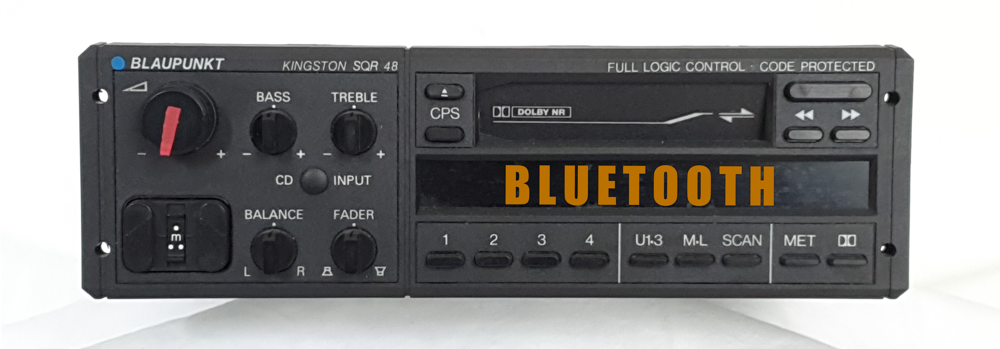
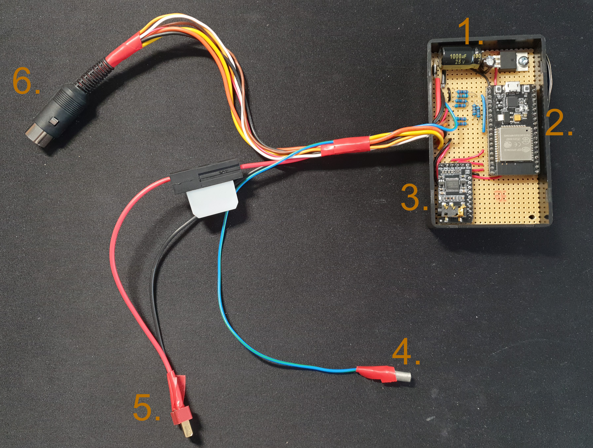
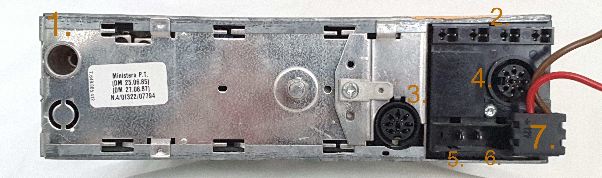
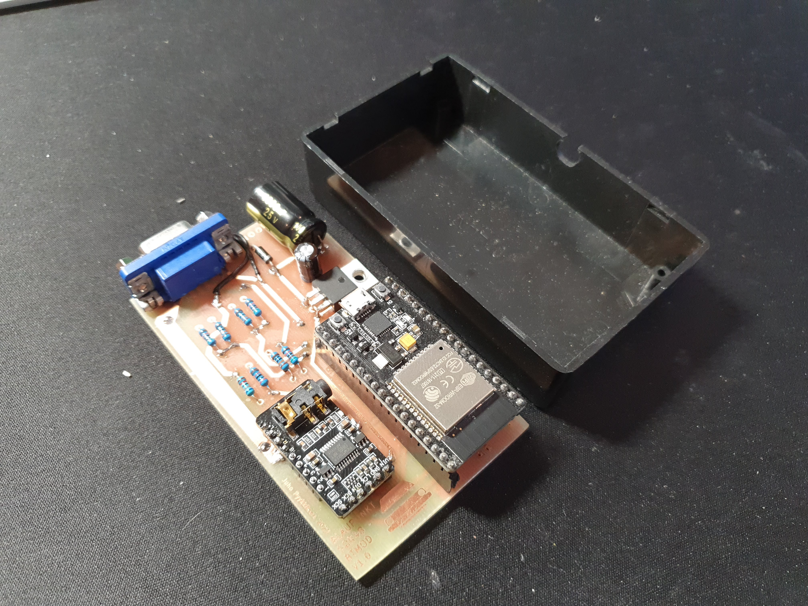
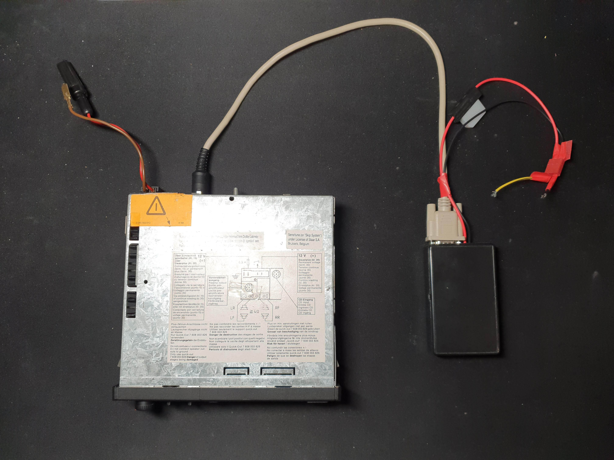
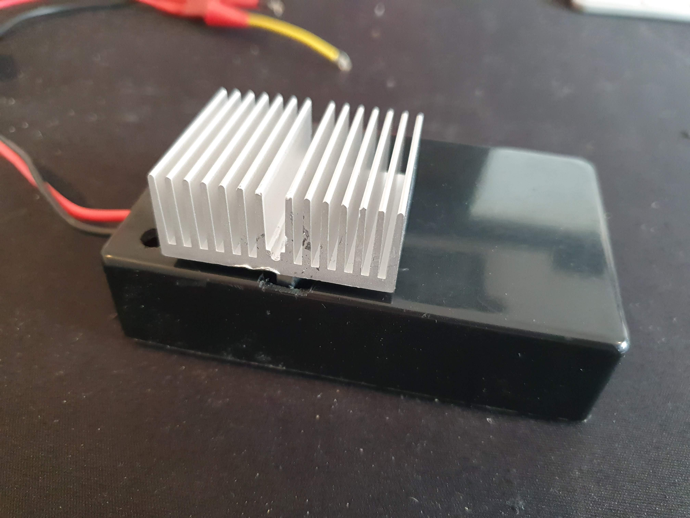

# Retrofit Bluetooth mod for BLAUPUNKT Kingston SQR48 car head unit 

This is a freetime modification/extension for Blaupunkt Kingston SQR48 head unit from 80's to add bluetooth functionality on it. The main principle was to keep the head unit appearance untouched. No external signals for added bluetooth are shown, so it will fit perfectly on restored 80's era car.

## Disclaimer

This is developed for my own needs and might include bugs. I'm not responsible if your cat dies.

## Functionalities

Because I didn't wanted add any extra buttons or control for the bluetooth, all bluetooth control functionalities are "improvised".

* Head unit changes audio input between radio/Cassette-player and Bluetooth depending if bluetooth device is connected. Eg. if phone is connected, head unit is in "Bluetooth Mode" otherwise audio is played from radio/Cassette-player.

* Bluetooth play/pause/next/previous can be controlled by Head unit's Cassette player's next/prev buttons. 

* All audio from Bluetooth goes throught Head unit's audio amplifer stage, so audio tune knobs and "signal indicators" on the LCD works. 

* If Head unit is turned off, Bluetooth is turned off.

## Hardware

The hardware is built around ESP32 module and is quite simple. Parts addition to ESP32 are 5V voltage regulator, PCM5102 Digital-to-analog converter and resistor diviters for inputs. Schematic can be found from (/Hardware/Schematic/Schematic.pdf).

Below is shown the module wired on breadboard.

1. 5V Voltage regulator
2. ESP32
3. PCM5102 DAC
4. Radio on (12V) signal
5. Power (12V) wires
6. Connector to Head unit's "CD-in" port

The Head Unit has following connections behind:

1. Antenna in
2. Speakers out
3. CD-in
4. Line-level out
5. 12v from battery
6. Radio on (12V) signal
7. Switched 12V and ground

For this mod, the Kingston SQR48 was an easy target. By manufacturer, it has reservation for an external CD-changer/player, which were available for it's eras cars. For that reason the Head unit has that "CD-in" connector (number 3 above), which are used to feed audio from Bluetooth module to the Head unit. 

The CD-in connector includes following pins:
- left and right audio channel inputs
- ground
- pin for switching the Head unit to CD-player mode (active if voltage feeded to this pin, 3V from ESP32 IO seems to be enought)
- Radio on (12V) signal (same signal thats coming from pin 5 at previous picture)

When the Head unit is in "CD-player" mode, it takes the audio input from that "CD-in" connector and connects that to the amplifier, thus AM/FM stage is bypassed. I used that feature, and set the Head unit to "CD-player" mode by using ESP32 when I want to feed audio from Bluetooth.

To get Cassette player's next/prev buttons to control the bluetooth, I soldered 3 extra wires to the Head unit's pcb to route the button's signals out from the Head unit. The CD-in connector coincidentally had three unused pins, which now got a job. The extra wires are the two green and one white middle on the picture below.

So the button's signals are routed to ESP32 via voltage dividers, which states are monitored by software. No changes were made for the original function, so the buttons also works as initially meant for cassette control when playing cassettes.

### UPDATE: Hardware version 1.1

After the first prototype done in breadboard, I created a better design with proper pcb. The design was initited to fit into plastic enclouser.

The design version 1.1 improved the overall physical durability against environment in a car and electrical charachteristics with proper ground plane and digital and analog separation. There is a VGA-connector for the cable connecting the module to the headunit. An additional heatsink was used to cool down the 5V voltage requlator. The functionality and software was left untouched from the previous breadboard design.

Picture of the module version 1.1 and it's enclosure. 

Picture of the module version 1.1 connected to the headunit.

Heatsink for voltage regulator.

## Software

The software is written using Visual Studio Code and PlatformIO extensions with arduino framework.

The root of the software is pschatzmann's ESP32-A2DP library. 

https://github.com/pschatzmann/ESP32-A2DP

Big thanks for pschatzmann providing this awesome library!

## Known bugs

## Changelog
* 5.9.2021 Created initial Github repo
* 2.7.2022 Added software sources
* 2.7.2023 Added V1.1 hardware schematics & updated readme
